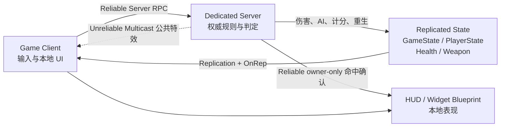

# Arena FPS

基于 Unreal Engine 5 官方 First Person 模板开发的多人第一人称竞技场 Demo，用于“腾讯开局第一课”课程作业。


项目仅在本地通过 Dedicated Server 与多个 Client 进程进行多人测试。服务器负责 AI、命中、伤害、计分、胜利和重生等权威逻辑；客户端提交操作请求并负责本地输入与 UI 表现。

> [查看 PDF 技术说明文档](output/pdf/Arena_FPS_技术说明文档.pdf)

## 演示

[](output/Arena四人联机效果演示.mp4)

演示视频时长约 87 秒，展示本地 Dedicated Server 下的四人客户端运行效果。

## 玩法概览

玩家在灰盒竞技场中移动、射击、拾取并切换武器，同时对抗服务器控制的敌人和其他玩家。

- 击败普通敌人获得 1 分。
- 击败其他玩家获得 3 分，自杀不计分。
- 玩家死亡后进入死亡镜头，5 秒后从随机 `PlayerStart` 重生。
- 默认目标分数为 10 分，首位达到目标分数的玩家获胜。
- HUD 显示生命、弹药、装填、武器名称、准星、命中反馈、个人分数、实时榜单和胜利提示。

## 核心功能

### 服务器权威网络架构

- 本地 Dedicated Server 多人测试。
- Client 通过 Reliable Server RPC 提交开火和切换武器等请求。
- 服务器执行命中检测、Projectile 生成、伤害、敌人生成、计分和胜负判定。
- 生命、武器、弹药、装填、分数和胜者通过属性复制与 `OnRep` 同步。
- 高频公共表现使用 Unreliable NetMulticast；命中确认使用 Reliable owner-only Client RPC。

### 敌人与 AI

- AI Perception 感知玩家并选择最近的存活目标。
- Behavior Tree 与 Blackboard 驱动追击和攻击。
- 攻击距离、冷却、前摇和伤害均由服务器检查。
- 支持受击、击退、死亡表现、延迟销毁和固定波次生成。

### 武器系统

- `ANetWeaponBase` 提供弹药、自动装填、射速、散布、后坐力、Camera Shake 和表现事件。
- 步枪与手枪使用服务器 Hitscan；榴弹发射器使用复制的服务器 Projectile 和范围伤害。
- 支持第一/第三人称武器 Mesh、武器拾取、定时刷新、库存与切换。
- 命中、开火、弹药、装填和散布通过 C++ 委托连接到 Widget Blueprint。

### 计分与 UI

- `PlayerState` 保存玩家名称和击杀分数，Pawn 重生后成绩不会丢失。
- `GameState` 同步目标分数与胜者，并从 `PlayerArray` 生成实时排序榜单。
- HUD 采用 C++ 数据绑定层与 Widget Blueprint 表现层分工。
- `BP_OnHitConfirmed` 只在服务器确认实际造成伤害后触发命中反馈。

## 架构概览



| 层级 | 主要类型 | 职责 |
| --- | --- | --- |
| 规则层 | `ANetGameMode` | 服务器计分、胜利检查、随机重生 |
| 公共状态层 | `ANetGameState` | 同步目标分数、胜者和多人榜单 |
| 玩家状态层 | `ANetPlayerStateBase` | 同步玩家名称与击杀分数 |
| 实体层 | `ANetCharacter`、`ANetNPC` | 移动、生命、死亡、武器持有与 AI 战斗 |
| 武器层 | `ANetWeaponBase` 及子类 | 权威开火、命中、伤害、弹药与表现分发 |
| 表现层 | `UNetHUDWidget` + Widget Blueprint | 将复制数据转换为 HUD 和动画 |

## 快速开始

### 环境要求

- Windows 10/11
- Unreal Engine 5.7
- Visual Studio 2022，安装“使用 C++ 的游戏开发”工作负载
- Git LFS（推荐，仓库包含 Unreal 二进制资产）

### 获取并打开工程

```powershell
git clone https://github.com/throusea/arena-fps.git
cd arena-fps
git lfs pull
```

1. 右键 `Arena.uproject`，选择 **Generate Visual Studio project files**。
2. 使用 Visual Studio 打开 `Arena.sln`。
3. 选择 `Development Editor | Win64` 并编译 `Arena`。
4. 打开 `Arena.uproject`，等待 Shader 和资产首次加载完成。
5. 确认测试地图为 `/Game/Variant_Network/Lvl_Net_GeryBox`。

## 本地 Dedicated Server 测试

在 Unreal Editor 的 Play 下拉菜单中打开 Multiplayer Options，并使用以下配置：

| 选项 | 建议值 |
| --- | --- |
| Number of Players | `2` 或更多 |
| Net Mode | `Play As Client` |
| Launch Separate Server | 启用 |

启动 PIE 后，编辑器会在本机运行独立服务器和多个客户端窗口。当前项目的多人验证范围是本地 Dedicated Server，不包含公网部署、在线会话、匹配或 NAT 穿透。

## 默认操作

| 操作 | 输入 |
| --- | --- |
| 移动 | `W` `A` `S` `D` |
| 视角 | 鼠标 |
| 跳跃 | `Space` |
| 开火 | 鼠标左键 |
| 切换武器 | `IA_SwapWeapon` 对应的 Enhanced Input 映射 |

具体输入映射位于 `Content/Input/` 与 `Content/Variant_Shooter/Input/`。

## 工程结构

```text
Arena/
├─ Config/                         # 项目、输入、碰撞与默认地图配置
├─ Content/
│  ├─ Variant_Network/             # 网络玩法关卡、角色、AI、武器和 UI 蓝图
│  ├─ Variant_Shooter/             # 官方 Shooter 模板与复用资产
│  └─ Input/                       # Enhanced Input 基础映射
├─ Source/Arena/
│  ├─ Variant_Network/             # 多人玩法 C++ 主实现
│  │  ├─ AI/
│  │  ├─ Components/
│  │  ├─ Spawning/
│  │  ├─ UI/
│  │  └─ Weapons/
│  ├─ Variant_Shooter/             # Shooter 模板 C++ 参考与基础能力
│  ├─ Variant_Combat/              # Combat 模板内容
│  └─ Variant_Horror/              # Horror 模板内容
├─ Docs/                           # 技术文档源稿与生成脚本
└─ output/pdf/                     # 最终 PDF 技术说明文档
```

## 关键实现索引

- 角色与武器持有：`Source/Arena/Variant_Network/NetCharacter.*`
- 游戏规则与同步状态：`NetGameMode.*`、`NetGameState.*`、`NetPlayerStateBase.*`
- 生命与敌人：`Components/NetHealthComponent.*`、`NetNPC.*`、`AI/NetAIController.*`
- 武器：`Weapons/NetRifle.*`、`NetProjectileWeapon.*`、`NetProjectile.*`、`NetWeaponPickup.*`
- HUD：`UI/NetHUDWidget.*`

## 技术文档

- [PDF 技术说明文档](output/pdf/Arena_FPS_技术说明文档.pdf)
- [Markdown 技术说明源稿](Docs/Arena_FPS_技术说明文档.md)
- [PDF 生成脚本](Docs/generate_technical_report.py)

## Codex 与 Skills

项目开发过程中使用 Codex 作为辅助开发 Agent，用于提供部分实现思路、拆解技术方案、编写与重构部分代码、分析网络通信链路，以及生成和排版技术文档。

相关工作使用了工程分析、GitHub、技术文档、PDF，以及项目本地 Unreal C++、Gameplay Ability System 和模块构建 Skills。功能取舍、工程整合与最终运行结果由开发者确认。

## 已知范围

- 多人功能目前仅在本地 Dedicated Server 环境中测试。
- 当前不包含公网服务器部署、在线匹配和账号系统。
- 工程包含 UE 官方模板和演示资源，重点是课程要求对应的玩法与网络实现。

## License

项目代码采用 [Apache License 2.0](LICENSE)。Unreal Engine 模板、Marketplace 或第三方资源仍遵循各自许可证。

---

最后更新：2026-06-22
